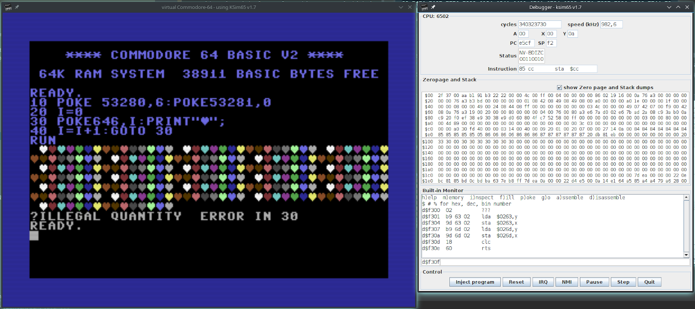

# KSim65 - Kotlin/JVM 6502/65C02 microprocessor simulator

*Written by Irmen de Jong (irmen@razorvine.net)*

*Software license: MIT, see file LICENSE*

This is a Kotlin/JVM library that simulates the 8-bit 6502 and 65C02 microprocessors,
 which became very popular in the the early 1980's.

Properties of this simulator:

- Written in Kotlin. It is low-level code, but hopefully still readable :-)
- Designed to simulate various hardware components (bus, cpu, memory, i/o controllers)
- IRQ and NMI simulation
- Aims to simulate correct instruction cycle timing, but is not 100% cycle exact for simplicity
- Aims to implements all 6502 and 65c02 instructions, including the 'illegal' 6502 instructions (not yet done)
- correct BCD mode for adc/sbc instructions on both cpu types
- passes several extensive unit test suites that verify instruction and cpu flags behavior
- simple debugging machine monitor, which basic disassembler and assembler functions
- provide a few virtual example machines, one of which is a Commodore-64

## Documentation

Still to be written. For now, use the source ;-)

## Using it as a library in your own project

Ksim65 is available on the [JCenter maven repository](https://bintray.com/irmen/maven/ksim65/1.7).

You can simply add it as a dependency to your project.
For Maven:

    <dependency>
        <groupId>net.razorvine</groupId>
        <artifactId>ksim65</artifactId>
        <version>1.7</version>
        <type>pom</type>
    </dependency>

For Gradle:

    implementation 'net.razorvine:ksim65:1.7'

## Virtual machine examples

Three virtual example machines are included.
The default one starts with ``gradle run`` or run the ``ksim64vm`` command.
There's another one ``ehBasicMain`` that is configured to run the "enhanced 6502 basic" ROM:

Finally there is a fairly functional C64 emulator running the actual roms (not included,
but can be easily found elsewhere for example with the [Vice emulator](http://vice-emu.sourceforge.net/).
The emulator supports character mode, bitmap mode (hires and multicolor), hardware sprites and
various timers and IRQs.  It's not cycle perfect, and the video display is drawn on a per-frame basis,
so raster splits/rasterbars are impossible. But many other things work fine.

